# Relative value strategies: a walk-forward and robustness study of stat-arb pairs and macro spread trades

This project provides a research pipeline for studying relative value trading strategies on market price data. Our main goal is to see how the performance of relative value strategies on different classes of pairs are affected by frictions such as trading costs and various model parameters. In particular, we address the extent to which natural statistical arbitrage ('stat-arb') pairs, thematically related pairs and broader cross-region pairs (or 'macro') remain attractive candidates for relative value strategies after walk-forward estimation, transaction costs, hedge rebalancing costs and benchmark-based evaluation are taken into account. We will see that that near-substitute pairs such as SPY/IVV become unprofitable after only modest costs are included, whilst thematically related pairs such as QQQ/XLK and cross-region pairs such as IEFA/EEM can still produce stable (although modest) out-of-sample performance.

The remainder of the README is organized as follows:

1. [Module summaries](#module-summaries): a brief description of each module in the repository
2. [Assumptions](#assumptions): a list of simplifying assumptions used in strategy construction and evaluation
3. [Background and methodology](#background-and-methodology): explanations of the main ideas behind spread construction, backtesting and evaluation
4. [Examples](#examples): a full run-through of the pipeline, including cointegration screening on a small selection of ETFs and strategy construction, backtesting and evaluation on three selected pairs
5. [Robustness checks](#robustness-checks): an extended study of the three examples from the previous section, addressing sensitivity to transaction costs, risk-free rates and other modelling choices

## Module summaries

`data.py` Loads and cleans adjusted price data for a user-specified universe of assets using yfinance (an open source tool that uses Yahoo Finance's publicly available APIs), generates all possible pairs from that universe and provides an initial screening step to identify potential stab-arb candidate pairs using the Engle–Granger cointegration test.

`signal_construction.py` Constructs the tradeable spread for a chosen pair in terms of a dynamic hedge ratio, which is estimated on a walk-forward basis using rolling regression. The resulting residual spread is standardised into an adaptive rolling z-score, which is then used to generate long, short and flat signals. For natural stat-arb pairs, this spread can be interpreted as a mean-reverting residual; for cross-region pairs, it is better interpreted as a dynamically hedged relative value signal.

`backtesting.py` Implements an out-of-sample backtest for the spread strategy described above using close-to-close returns. The module computes daily gross and net returns, incorporates entry/exit costs and hedge rebalancing costs, and tracks cumulative performance and drawdowns. 

`evaluation.py` Computes performance metrics for both the strategy and a chosen benchmark, including total return, annualised return, annualised volatility, annualised Sharpe ratio and maximum drawdown. We also extract trade-level information such as trade count, holding periods, hit rates and payoff characteristics. (In the broader context of this project, this module is used not just to rank candidate pairs, but also to see how the performance of relative value strategies on different classes of pairs are affected by realistic frictions and various model parameters.)

`main.py` Initiates the pipeline, either in full or in part as specified by the user. It allows the user to specify a universe of assets for screening, select a pair of assets on which to run the strategy, choose benchmark and transaction-cost assumptions, and specify other parameters such as various timeframes. It then runs the user-specified parts of the pipeline end-to-end (pair screening, signal construction, backtesting and evaluation). 

## Assumptions

Although a large part of this project is to explore the effect certain realistic trading frictions on the performance of relative value strategies, our strategy construction and backtesting pipeline still relies on a few simplifying assumptions about the trading environment:

- **Trades occur at close.** Signals are generated using end-of-day price data, and entries, exits and hedge rebalancing are assumed to occur at close. This is a simplifying approximation to trading near market close.

- **No capital or leverage constraints.** The strategy is not prevented from taking the desired positions because of limited capital, leverage caps or broker-imposed exposure limits.

- **No financing or margin requirements.** We assume that no financing costs are incurred on investment capital, and that there are no broker-imposed margin requirements. As a result, returns are computed simply by normalising by prior-day gross exposure.

- **Shorting is frictionless.** We assume that short positions can always be established and maintained, with no borrowing fees, recalls or other restrictions. (This is related to the previous assumption regarding no margin requirements.)

- **Simplified model of transaction costs.** Entry, exit and hedge rebalancing costs are represented as fixed basis-point costs per unit traded. Bid-ask spreads, slippage and market impact are not considered. 

- **Sufficient liquidity.** We assume that all trades can be executed at observed close prices in the desired quantities, with no volume constraints or partial fills.

- **No stop-loss or external risk controls.** Positions are closed according to the signal rules alone, rather than through discretionary or risk-management interventions.

The assumptions above largely concern the trading environment. We also point out the following modelling choices: 

- **Use of adjusted prices.** Historical prices are taken from the _adjusted close_ series in `yfinance`, i.e. the close price adjusted for corporate actions such as splits and dividends. This choice makes the backtest closer to a total-return framework, but it also means that signal construction is based on a price series that is not identical to the quoted close price observed at the time of trading. Furthermore, the adjusted close price is a function of all corporate actions that happen _after_ that date, which in the event of dividend cashflows introduces a lookahead bias. A more realistic implementation would use split-adjusted (but not dividend-adjusted) prices for signal generation and incorporate dividend cashflows into PnL separately; we plan to use such an implementation in later updates to this project.  

- **Cointegration is a helpful diagnostic, not a universal requirement.** The Engle–Granger test is useful for identifying plausible stat-arb candidates, but thematically-related pairs and cross-region pairs may still be economically interesting even when they do not satisfy a strict cointegration criterion.

- **The rolling hedge ratio is a modelling device, not necessarily a structural equilibrium.** For natural stat-arb pairs, the hedge ratio is crucial to identifying large deviations from the mean,  which we interpret as a structural equilibrium. For other pairs, the hedge ratio is used simply to maintain dynamic hedging.

- **A simple benchmark.** By default, benchmark comparisons are made against a long-only position on SPY, which is informative but not directly equivalent to a market-neutral capital allocation one typically looks for in relative value strategies.

- **Parameter sensitivity.** As we will study in more detail below, performance may be sensitive to formation windows, z-score windows and entry/exit thresholds.

## Background and methodology 

Rather than trying to predict the absolute price movement of a single asset, a relative value strategy attempts to predict the relative movement of two related assets. In the classical stat-arb setting, the two assets are chosen because they are believed to share a stable long-run relationship, often formalised through _cointegration_ (roughly speaking, two assets are said to be _cointegrated_ if some linear combination of their market price exhibits a long-term, stable equilibrium relationship). More broadly, relative value strategies may also be constructed from thematically related, cross-region or macro/factor-sensitive assets, where the spread is interpreted less as a deviation from a long-term equilibrium and more as a dynamically hedged relative performance signal.

Although we do not treat cointegration in this project as a universal requirement for all relative value strategies, we still use it as an initial helpful screen for some classes of pairs, and therefore give a brief description of the concept as follows. Consider two time series $x_t$ and $y_t$ representing daily price data for two assets $X$ and $Y$. The standard Engle-Granger test assumes that both $x_t$ and $y_t$ are integrated to order one, denoted $I(1)$, meaning that they are non-stationary but their first differences ($\Delta x_t = x_t - x_{t-1}$ and $\Delta y_t = y_t - y_{t-1}$) are stationary. One way to check this is to test for a unit root using e.g. the ADF test, although we won't explain this here. The Engle-Granger method then regresses one time series on the other using ordinary least squares, yielding

$$y_t = \alpha + \beta x_t + \epsilon_t$$

for some $\alpha,\beta\in\mathbb{R}$. We call $\epsilon_t$ the _residual_ or the _spread_. The time series $x_t$ and $y_t$ are cointegrated if the residual $\epsilon_t$ is itself stationary, which can be tested using a standard t-statistic under the null hypothesis of no cointegration. In `data.py`, we use `statsmodels.coint` on a pair of time series to test for cointegration, which returns the t-statistic and associated p-value. 

Suppose we now wish to construct a tradeable spread using two related assets $X$ and $Y$ (which may or may not be cointegrated). In `signal_construction.py`, we use ordinary least squares linear regression (using `statsmodels.OLS`) to construct this spread:

$$\epsilon_t = y_t - \alpha - \beta x_t.$$

We refer to $\beta$ as the _hedge ratio_. As explained above, for natural stat-arb pairs this spread may be viewed as a candidate mean-reverting residual. For broader relative value trades, the hope is that this regression-based construction will remove much of the common directional exposure held by $X$ and $Y$, and that the resulting spread is better viewed as a dynamically hedged measure of relative performance. We point out that our code in `signal_construction.py` incorporates a dynamic hedge ratio using rolling regression, whereby the coefficients $\alpha$ and $\beta$ are continually updated using some fixed sized window of past data. The intention is that this additional flexibility reflects changing correlations and volatilities in the long term. 

We then compute the adaptive z-score $Z_N$ of the spread using the rolling mean $\mu_N$ and rolling standard deviation $\sigma_N$ from the previous $N$-day window:

$$Z_N = \frac{\epsilon_t - \mu_N}{\sigma_N}.$$

('Adaptive' here refers to the fact that the last $N$ residuals are computed using their respective $\beta$'s, rather than using the current day's $\beta$.) This provides a normalised measure of how unusual the current spread is relative to its recent behaviour (or, more precisely in the case of a stat-arb pair, how much the spread has deviated from its equilibrium). In what follows we assume $N$ is fixed and denote $Z_N$ by $Z$. 

We now build our strategy: if the z-score becomes high (e.g. above 2), then this might indicate that $Y$ is overpriced relative to $X$, in which case we go short on the spread (i.e.~short on 1 share of $Y$ and long on $\beta$ shares of $X$). If the z-score becomes low (e.g. below -2), then this might indicate that $Y$ is underpriced relative to $X$, in which case we go long on the spread (i.e.~long on 1 share of $Y$ and short on $\beta$ shares of $X$). If the z-score returns close to zero (e.g. above -0.5 while we are long on the spread, or below 0.5 while we are short on the spread), then we close our position (sell our long positions and buy back our short ones). 

We label our position as +1 if we're currently long on the spread, -1 if we're currently short on the spread, and 0 if our position is flat (i.e. we have no open positions). Let $z_{\text{entry}}$ denote a fixed entry threshold and $z_{\text{exit}}$ a fixed exit threshold. We use the following rules:

- If on day $t$ our position is 0 and at close it holds that $Z < -z_{\text{entry}}$, then we enter a long spread position using the close price and enter our position as +1 from day $t+1$.
- If on day $t$ our position is 0 and at close it holds that $Z > z_{\text{entry}}$, then we enter a short spread position using the close price and enter our position as -1 from day $t+1$.
- If on day $t$ our position is +1 and at close it holds that $Z > -z_{\text{exit}}$, then we exit our position using the close price. If at close it further holds that $Z > z_{\text{entry}}$, then we enter a short spread position using the close price and enter our position as -1 from day $t+1$; otherwise, we enter our position as 0 from day $t+1$.
- If on day $t$ our position is -1 and at close it holds that $Z < z_{\text{exit}}$, then we exit our position using the close price. If at close it further holds that $Z < -z_{\text{entry}}$, then we enter a long spread position using the close price and enter our position as +1 from day $t+1$; otherwise, we enter our position as 0 from day $t+1$.

(Position reversals (jumping from +1 to -1 or vice versa) should be relatively uncommon for sensible pairs and reasonable entry/exit thresholds, but these possibilities must be considered nonetheless and introduce some additional complexity to the code.)

The next step is to backtest the strategy. If the strategy holds a long spread position from the close of day $t-1$ to the close of day $t$, then its gross return on day $t$ is

$$\frac{\Delta y_t - \beta_{t-1}\Delta x_t}{|y_{t-1}| + |\beta_{t-1} x_{t-1}|},$$

where $\Delta y_t = y_t - y_{t-1}$, $\Delta x_t = x_t - x_{t-1}$ and $\beta_{t-1}$ is the hedge ratio computed at close on day $t-1$. For a short spread position, the sign of the gross return is reversed. Note that the denominator here is the gross exposure held at close on day $t-1$, and so the gross returns are interpreted as PnL on day $t$ as a fraction of yesterday's gross capital at risk. (If margin costs are incurred e.g. as some fraction of gross exposure, one may choose to include this in the denominator. We assume in this project that there are no margin costs.)

The transcation cost of entering or exiting a position on day $t$ is specified as a certain number of basis points $C_{bp}$ per unit turnover, i.e.

$$c = \frac{C_{bp}}{10,000}$$

per unit currency traded. A reasonable assumption is $1 \leq C_{bp} \leq 5$. If we enter a position at close on day t, our cost for one spread unit is therefore $c(|y_t| + |\beta_t x_t|)$, and hence we should subtract the following quantity from gross returns for that day:

$$ \tag{1} {c \cdot \frac{|y_t| + |\beta_t x_t|}{|y_{t-1}| + |\beta_{t-1} x_{t-1}|}.} $$

Similarly, if we exit a position at close on day $t$, our cost for one spread unit is $c(|y_t| + |\beta_{t-1} x_t|)$, and hence we should subtract the following quantity from gross returns for that day:

$$ \tag{2} {c \cdot \frac{|y_t| + |\beta_{t-1} x_t|}{|y_{t-1}| + |\beta_{t-1} x_{t-1}|}.} $$

Typically, the ratios in equations (1) and (2) are close to one, and the current version of our code uses this approximation. The rebalancing costs, which are typically incurred every day a position is held (with the exception of the day the position is exited) are also subtracted from gross returns and are given by 

 $$ c \cdot \frac{|\Delta \beta_t| x_t}{|y_{t-1}| + |\beta_{t-1} x_{t-1}|}, $$

where $\Delta \beta_t = \beta_t - \beta_{t-1}$. After subtracting these transaction costs we arrive at the net return $r_t$ for day $t$, and the net return for a given period is then 

$$ R = \prod_t (1+r_t) - 1.$$

Finally we evaluate the performance of the strategy. We first compute the maximum drawdown, which is the largest peak-to-trough percentage decline in cumulative net returns over the trading period. A low maximum drawdown is good for many reasons. For example, if the strategy is being leveraged, then large drawdowns may force deleveraging or liquidiation before a recovery has a chance to happen. More generally, a risk-averse investor may also impose (or be subject to) strict maximum drawdown limits, again leading to liquidation before any recovery. 

Beyond computing cumulative net return $R$ for the whole trading period consisting of $d$ days, we also provide annualised metrics which make for easier comparisons with other strategies over different periods. Assuming the number of trading days in a year is 252, the annualised return is

$$ R_{\text{annual}} = (1+R)^{\frac{252}{d}} - 1 $$

and the annualised volatility is 

$$ \sigma_{\text{annual}} = \sqrt{252}\sigma_{\text{daily}}, $$

where $\sigma_{\text{daily}}$ is the daily volatility given by the standard deviation of daily returns over the trading period. We also compute the annualised Sharpe ratio, a risk-adjusted measure of the performance of the strategy relative to a risk-free investment. If $\overline{r}$ denotes the daily mean return over our trading period, $r_f^{\text{annual}}$ is the annual risk-free rate (which we assume for simplicity to be constant over the trading period) and $r_f^{\text{daily}} = (1+r_f^{\text{annual}})^{\frac{1}{252}} - 1$ is the daily risk-free rate, then the annualised Sharpe ratio is given by 

$$ S = \frac{252(\overline{r} - r_f^{\text{daily}})}{\sigma_{\text{annual}}}, $$

i.e. it is the mean daily excess return, multiplied by the number of trading days in a year, divided by the yearly volatility. In main.py, these metrics are also computed for a benchmark strategy, which by default is a long-only position on SPY (an ETF designed to track the S&P 500). Again, we point out that this benchmark is useful as a reference point, though it is not directly equivalent to a market-neutral capital allocation that one typically looks for in relative value strategies. Finally, we produce statistics on the trades themselves, including e.g. the trade count, the hit rate (the proportion of trades with positive net returns) and the average holding period. 

## Baseline examples 

In this section, we first illustrate the cointegration screening process from `data.py` on a small universe consisting of three ETFs. Next, we demonstrate the remainder of the pipeline on three representative pairs of ETFs, and compare how these different classes of relative value trades perform in a baseline setting whereby trading costs and the risk-free rate are set to zero. In the next section we will adjust these (and other) parameters and evaluate to what extent any apparent edge survives realistic frictions. 

The three pairs we consider are: 

- **SPY/IVV:** a near-substitute pair of ETFs with both assets tracking the performance of the S&P500. 

- **QQQ/XLK:** a thematically related pair of ETFs with high overlap on large-cap U.S. technology. More precisely, QQQ tracks the Nasdaq-100 index and has a heavy exposure to technology firms, and XLK tracks the technology sector of the S&P500. 

- **IEFA/EEM:** a cross-region pair of ETFs, both driven by common macroeconomic factors such as global growth and risk appetite, but with differing exposures. Both track indices consisting of non-US equities, with IEFA focusing on developed markets and EEM focusing on emerging markets. 

### Cointegration screening

If `find_pairs = True` in `main.py`, the function `find_coint_pairs` from `data.py` will run the Engle-Granger cointegration test on all possible pairs from the specified universe `tickers` over a specified timeframe, and print a list of the pairs for which the resulting p-value is less than `pvalue_threshold`. If `plots1 = True`, some plot will also be produced. In this example, we use the following parameters:

<pre>
tickers = ["QQQ", "XLK", "GLD"]                                        #tickers of assets under consideration; all possible pairs will be assessed for cointegration in data.py if find_pairs = True
start_date = pd.Timestamp('2010-01-01')                                #starting date for price data (also taken to be the start of the formation period)
formation_window = 6                                                   #number of previous years used to compute OLS coefficients
formation_end = start_date + pd.DateOffset(years = formation_window)   #end of initial formation period, i.e. the first date we compute the spread using formation_window years of previous price data    
pvalue_threshold = 1.0                                                 #p-value for Engle-Granger test (set to 1.0 to see p-values and plots for all possible pairs)

find_pairs = True                #set to false if you don't want to run cointegration screening 
plots1 = True                    #set to false if you don't want to see plots from the cointegration screening
</pre>

Since we have set `pvalue_threshold = 1.0`, all pairs (three in this case) and their corresponding plots will be produced. Before running any code, it is worth asking what we might expect. QQQ and XLK are highly overlapping large-cap U.S. technology/growth ETFs, but not direct substitutes for each other. So whilst they may be good candidates for a cointegration-based pair trading strategy, it is unlikely that they are genuinely cointegrated in the mathematical sense. On the other hand, GLD is an ETF designed to track the price of gold bullion, which we'd expect to bear limited relation to QQQ or XLK. This intuition is somewhat reflected in the p-values for cointegration appearing in the following table:

| Ticker 1 | Ticker 2 | p-value |
|--------|--------|--------:|
| QQQ | XLK | 0.078678 |
| QQQ | GLD | 0.584890 |
| XLK | GLD | 0.621507 |

Further insights can be gained from the plots generated in `run_plots1`. Here, we show only the plots of normalised prices for the pairs QQQ/XLK and GLD/QQQ; in the former case, we see there is certainly a position correlation in the short-term price movements between the two assets, whereas the situation is unclear for the latter pair. (Of course, correlation and cointegration are distinct concepts -- the purpose of these plots is simply to get a better idea of relative price movements.)

  

  

### Selected pairs

We now illustrate the remainder of the pipeline on the three representative pairs of ETFs listed at the start of this section.  In addition to the relevant parameters previously set in the cointegration screening, we also fix (for now) the following:

<pre>
end_date = pd.Timestamp('2026-04-16')             #ending date for price data 
zscore_window = 50                                #rolling window in trading days for computing the z-score of the spread
benchmark = ['SPY']                               #choose a single benchmark asset to compare our strategy against
entry_threshold = 1.5                             #value of z-score above/below zero to trigger entering a short/long position on the spread
exit_threshold = 0.25                             #value of z-score above/below zero to trigger exiting a short/long position on the spread
cost_bps = 0.0                                    #transaction cost in basis points
trading_days = 252                                #trading days in a year
risk_free_rate = 0.00                             #risk-free interest rate (used to compute the annualised Sharpe ratio)

build_strat = True                 #set to false if you only want to carry out cointegration screening and don't yet want to build a strategy for a fixed pair
plots2 = True                      #set to false if you don't want to see plots of the spread, z-score and positions from signal_construction.py
plots3 = True                      #set to false if you don't want to see plots of returns and drawdowns from backtesting.py
show_individual_trades = True      #set to false if you don't want to see the list of individual trades
</pre>

We stress once again that although `cost_bps` and `risk_free_rate` are set to zero for now, we will consider the effect of varying these parameters in the next section. 

**Example 1** (`pair = ['SPY, 'IVV'])`): 

In our first example we consider the near-substitute pair SPY/IVV. Before constructing and backtesting the strategy for this pair, we first look at the plot of their adjusted prices (in this particular case, there is no need to normalise prices to aid visualisation):

  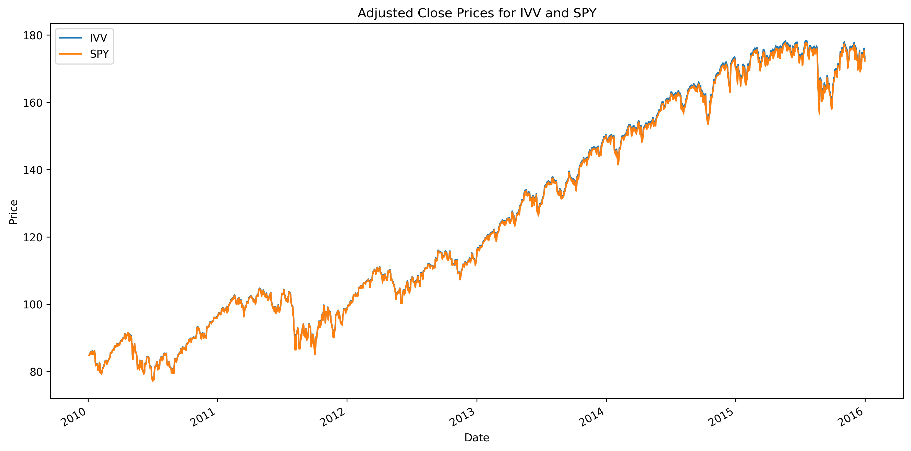

We see that the two time series are almost indistinguishable from each other, except perhaps that IVV is generally priced a fraction higher. Curiously, the p-value arising from the Engle-Granger cointegration test (which is computed as part of the pipeline in `main.py` for a fixed pair even if cointegration screening is not performed) for the period under consideration is 0.102, which is perhaps higher than expected for a pair we claim is a natural stat-arb candidate. Allowing for a linear trend in the `test_coint` function in `data.py` returns a smaller p-value of 0.015, or alternatively using non-adjusted price data (see the [Assumptions](#assumptions) section) in the `load_prices` function in `data.py` returns a p-value of almost zero. Thus, while the Engle-Granger test can serve as a useful diagnostic, it is sensitive to modelling choices and should not be used in isolation to make decisions. 

In `signal_construction.py`, the dynamic hedge ratio, resulting spread and adaptive z-score SPY/IVV are computed. We see that besides an initial upward drift and a few isolated extreme jumps (which could result from even a small price jump in one asset after a period of low spread volatility), the spread remains largely stable around zero: 

  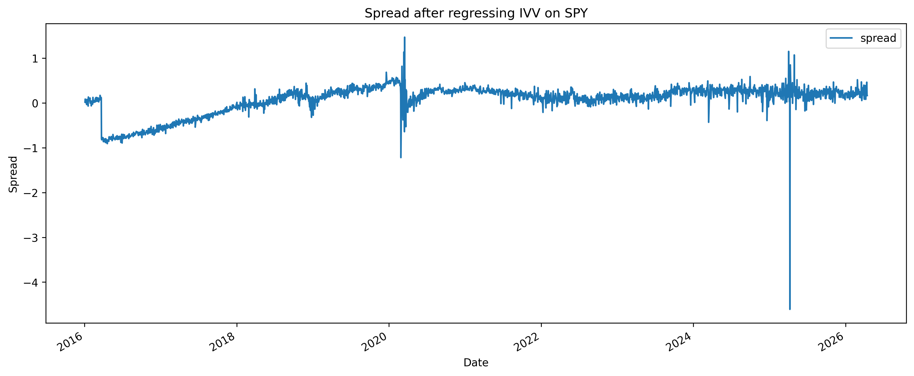

We also obtain the following plot of the adaptive z-score `run_plots2`:

  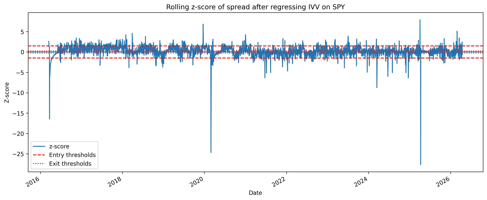

The final outputs from `signal_construction.py` are the trading positions generated according to the strategy described above, which can be visualised as follows (note that the flat parts in this and the following plots correspond to the formation periods where no trading takes place): 

  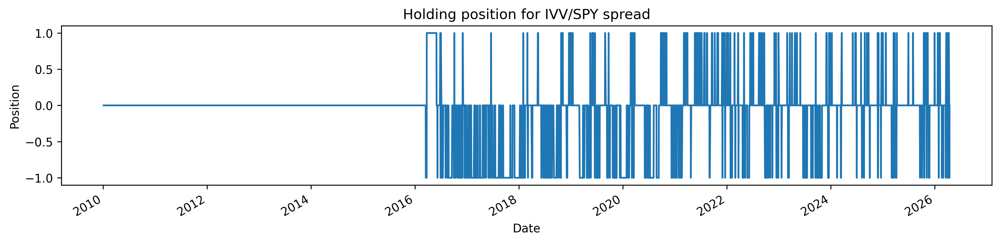

Next, the strategy is backtested in `backtesting.py`, yielding the following plots of cumulative net returns and drawdowns:

  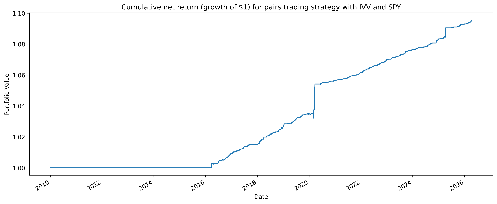

  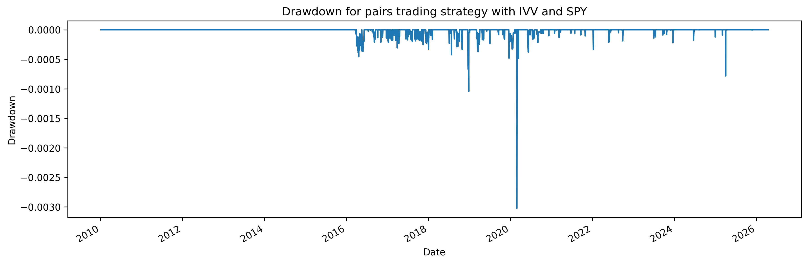

Finally, the performance of the strategy is evaluated using `evaluation.py` and compared against the performance of a specified benchmark, which in our case is simply a long position on `benchmark = ['SPY']` (an ETF designed to track the S&P 500):

|                         | Strategy   | Benchmark   |
|:------------------------|:-----------|:------------|
| Total return            | 9.54%      | 304.06%     |
| Annualised return       | 0.91%      | 14.89%      |
| Annualised volatility   | 0.35%      | 17.88%      |
| Annualised Sharpe ratio | 2.56       | 0.87        |
| Maximum drawdown        | 0.30%      | 33.72%      |

The beta of our strategy relative to the benchmark and correlation of returns between our strategy and benchmark are as follows: 

<pre>
Beta relative to the benchmark: 0.0007
Correlation with the benchmark: 0.0345
</pre>

We see that with the current parameters, the SPY/IVV spread produces very modest positive returns, with extremely low volatility, drawdowns, market beta and market exposure. Although the annualised Sharpe ratio for the strategy is much larger than that of the benchmark, this is clearly a result of low volatility rather than large returns.

The individual trade statistics for the strategy are as follows; perhaps the most noteworthy of these are the 99.61% hit rate (the percentage of trades that resulted in positive returns) but tiny average return of 0.04% per trade:

|                              |        |
|:-----------------------------|:-------|
| Trade count                  | 256.00 |
| Hit rate                     | 99.61% |
| Avg trade return             | 0.04%  |
| Median trade return          | 0.02%  |
| Best trade return            | 0.48%  |
| Worst trade return           | -0.01% |
| Avg win                      | 0.04%  |
| Avg loss                     | -0.01% |
| Payoff ratio                 | 3.40   |
| Avg holding period (days)    | 3.38   |
| Median holding period (days) | 2.00   |

**Example 2** (`pair = ['QQQ, 'XLK'])`):

In our second example we consider the thematically-related pair QQQ/XLK. As we have already observed, the plot of normalised adjusted prices for QQQ and XLK demonstrates a position correlation in their short-term price movements:

  

The Engle-Granger test returns a p-value of 0.0787, although unlike the SPY/IVV pair this is stable under changing from adjusted prices to raw prices. Therefore, even though the p-value in this case is smaller than that of SPY/IVV, this does not immediately imply stricter cointegration than SPY/IVV, and indeed the following plot shows there is noticeably more volatility in the QQQ/XLK spread: 

  

The plots of the adaptive z-score and trading positions are as follows:

  

  

Backtesting the strategy then yields the following plots of cumulative net returns and drawdowns:

  

  

Evaluating the strategy and comparing once again to the long-only SPY benchmark, we obtain: 

|                         | Strategy   | Benchmark   |
|:------------------------|:-----------|:------------|
| Total return            | 21.33%     | 304.06%     |
| Annualised return       | 1.94%      | 14.89%      |
| Annualised volatility   | 2.11%      | 17.88%      |
| Annualised Sharpe ratio | 0.92       | 0.87        |
| Maximum drawdown        | 3.12%      | 33.72%      |

The beta of our strategy relative to the benchmark and correlation of returns between our strategy and benchmark are: 

<pre>
Beta relative to the benchmark: 0.0087
Correlation with the benchmark: 0.0734
</pre>

We see that with the current parameters, the QQQ/XLK spread produces modest positive out-of-sample returns with low volatility, drawdowns and market correlation, and very low market beta. As with SPY/IVV, the strategy does not come close to matching the absolute performance of long-only equity exposure over the same period, although the risk-adjusted performance is perhaps slightly more comparable. 

Individual trade statistics for the strategy are as follows, and contrast quite significantly with those for the SPY/IVV strategy: 

|                              |        |
|:-----------------------------|:-------|
| Trade count                  | 91.00  |
| Hit rate                     | 80.22% |
| Avg trade return             | 0.21%  |
| Median trade return          | 0.31%  |
| Best trade return            | 1.20%  |
| Worst trade return           | -2.21% |
| Avg win                      | 0.39%  |
| Avg loss                     | -0.49% |
| Payoff ratio                 | 0.79   |
| Avg holding period (days)    | 16.53  |
| Median holding period (days) | 11.00  |

**Example 3** (`pair = ['IEFA, 'EEM'])`):

In our final example we consider the cross-region pair IEFA/EEM. The plot of their adjusted prices demonstrates some positive correlation in their short-term price movements: 

  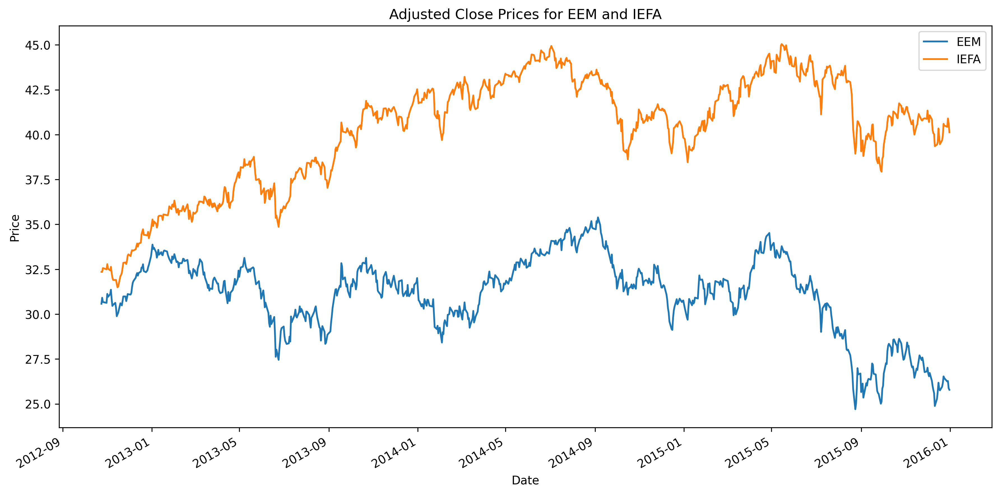

The Engle-Granger test returns a p-value of 0.2534, and the following plot shows once again significantly more volatility than the SPY/IVV spread: 

  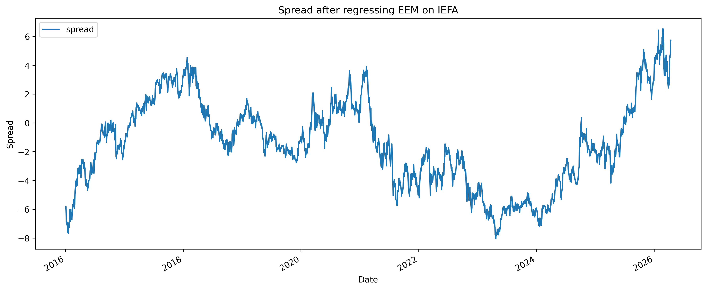

The plots of the adaptive z-score and trading positions are as follows:

  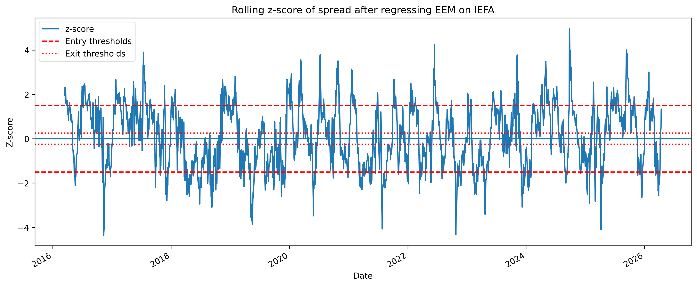

  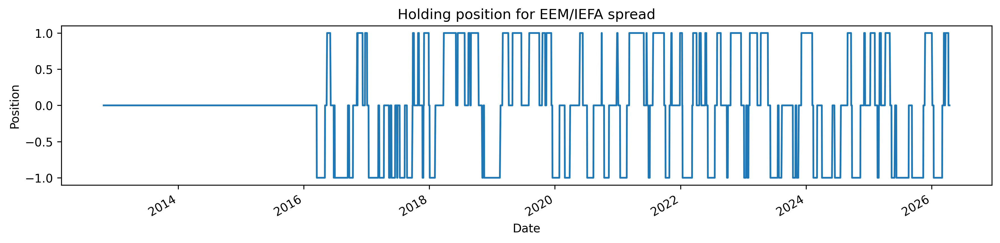

Backtesting the strategy then yields the following plots of cumulative net returns and drawdowns:

  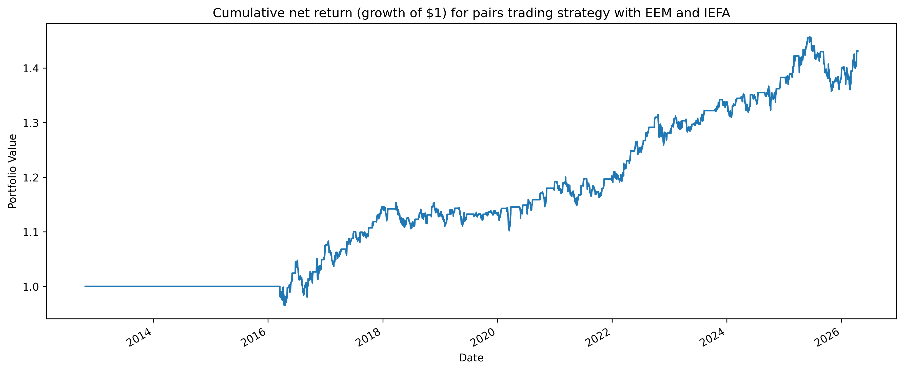

  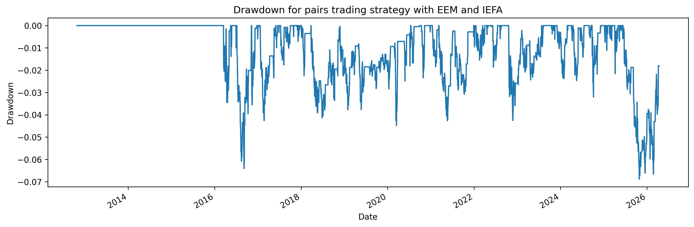

Evaluating the strategy and comparing once again to the long-only SPY benchmark, we obtain:

|                         | Strategy   | Benchmark   |
|:------------------------|:-----------|:------------|
| Total return            | 43.09%     | 304.06%     |
| Annualised return       | 3.63%      | 14.89%      |
| Annualised volatility   | 5.54%      | 17.88%      |
| Annualised Sharpe ratio | 0.67       | 0.87        |
| Maximum drawdown        | 6.88%      | 33.72%      |

The beta of our strategy relative to the benchmark and correlation of returns between our strategy and benchmark are: 

<pre>
Beta relative to the benchmark: -0.0109
Correlation with the benchmark: -0.0352
</pre>

We see that with the current parameters, the IEFA/EEM spread produces moderate positive out-of-sample returns with relatively low volatility and drawdowns, and low market correlation and market beta. Once again, the strategy does not come close to matching the absolute performance of long-only equity exposure over the same period, although the risk-adjusted performance is more comparable. 

Individual trade statistics for the strategy are as follows:

|                              |        |
|:-----------------------------|:-------|
| Trade count                  | 80.00  |
| Hit rate                     | 71.25% |
| Avg trade return             | 0.46%  |
| Median trade return          | 0.79%  |
| Best trade return            | 2.67%  |
| Worst trade return           | -3.86% |
| Avg win                      | 1.05%  |
| Avg loss                     | -1.02% |
| Payoff ratio                 | 1.03   |
| Avg holding period (days)    | 20.15  |
| Median holding period (days) | 17.00  |

## Robustness checks 

Finally we consider the robustness of the above strategies with respect to trading costs and other parameters, starting with the pair SPY/IVV. The tight relationship between these two assets is likely a large contributing factor to the small average trade return of 0.04%, suggesting that even small transaction costs will sharply decrease the hit rate of 99.61% and wipe out overall returns. This is confirmed by the following plot of total returns and hit rate as a function of the cost in basis points (bps): 

  

We also observed that the large Sharpe ratio of 2.56 for the strategy was a result of low volatility rather than high returns. We should therefore expect a positive Sharpe ratio to persist for only small positive transaction costs and risk-free rates, as demonstrated in the following heat map; we draw two contour lines, one where the Sharpe ratio is zero and the other where it is equal to half its value in the case where transaction costs and the risk-free rate are set to zero. 

  

Next we consider the pair QQQ/XLK. We see that the strategy for this pair is more robust than for SPY/IVV: both the total returns and the hit rate are less sensitive to initial increases in transaction costs:

  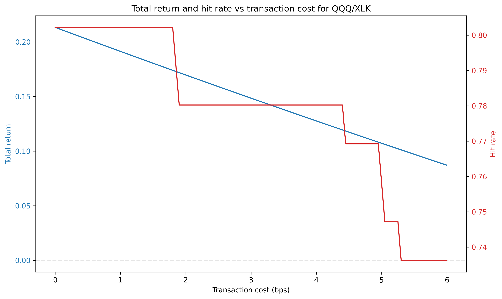

We also have the following heat map for the Sharpe ratio, which also demonstrates less sensitivity to transaction costs and risk-free rates than for the SPY/IVV strategy:

  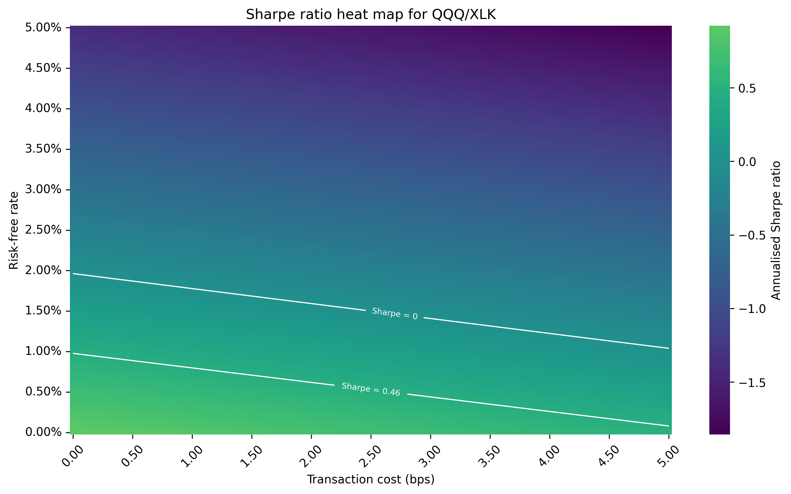

Finally, we see even stronger robustness in the strategy for IEFA/EEM:

  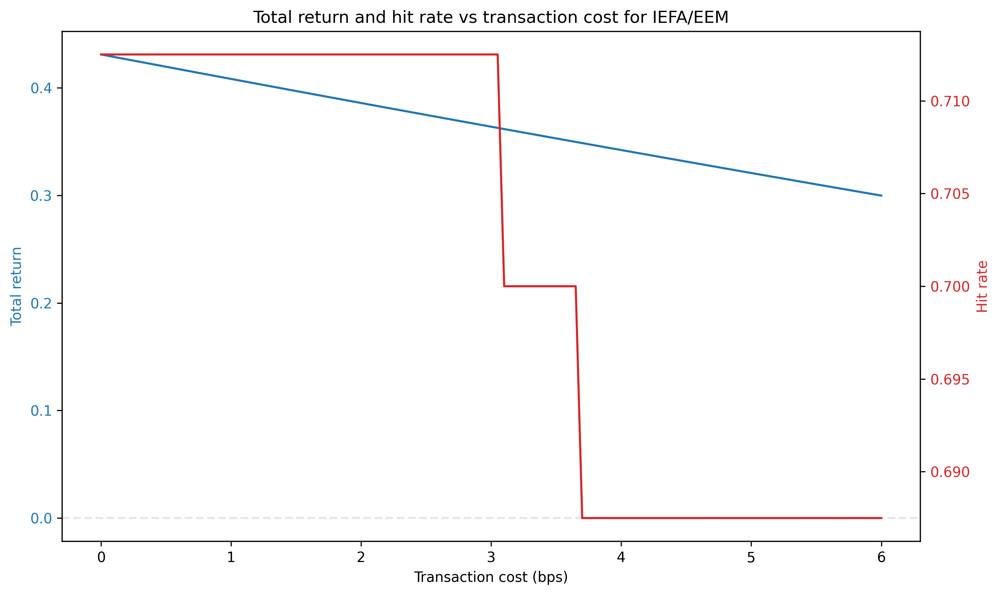

  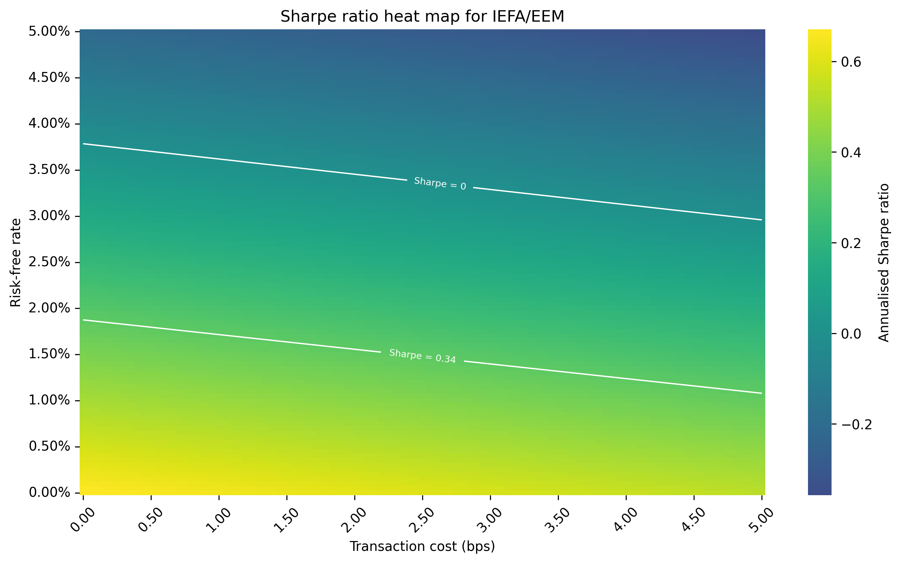

TO DO: study sensitivity to other parameters (such as timeframes). 