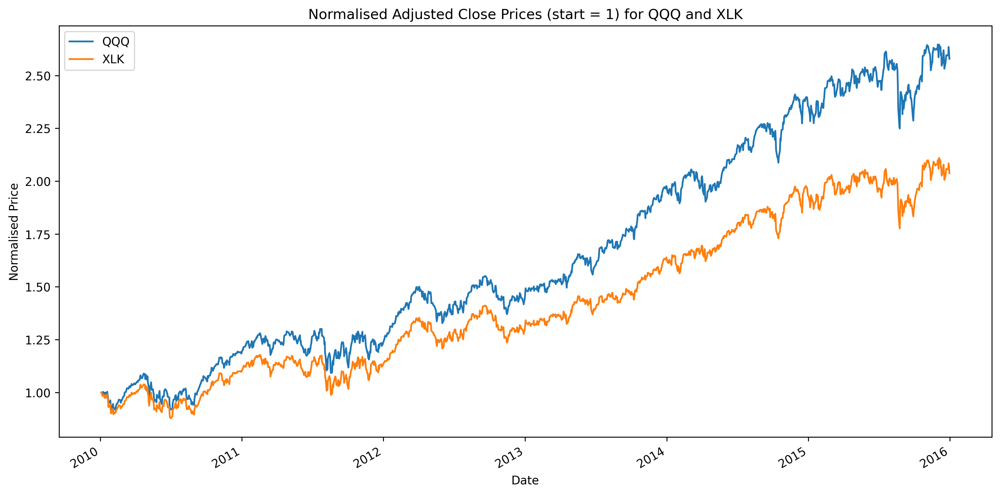
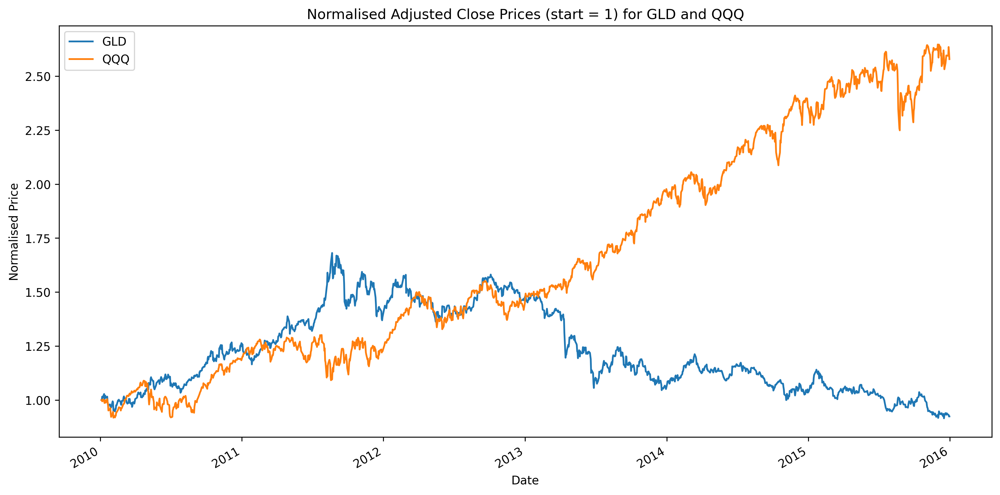
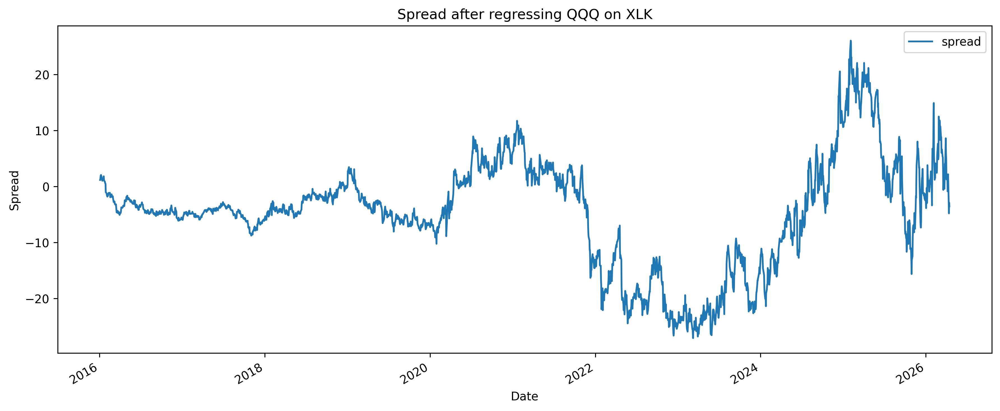
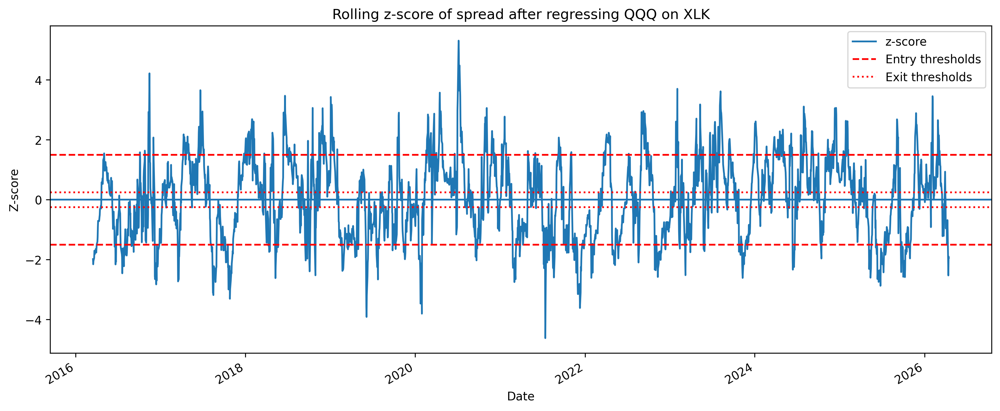
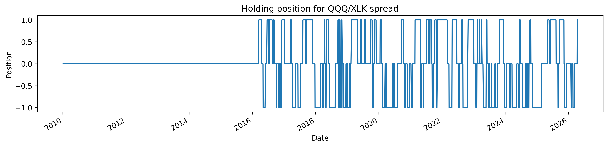
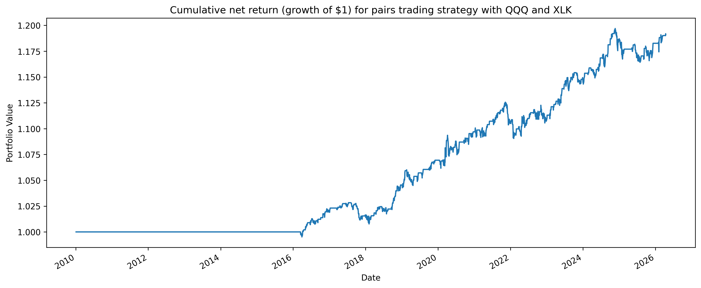
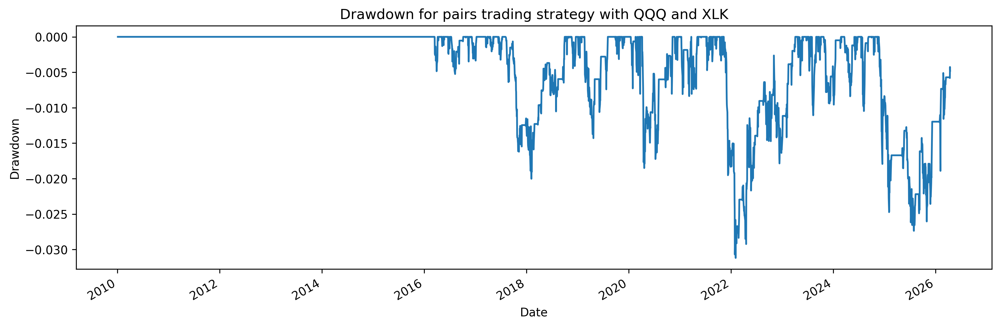

# Pairs trading

This project is a research pipeline for testing a cointegration-based pairs trading strategy on market price data. More details on the pipeline can be found in the file descriptions below, and we also include a section explaining the required background knowledge to understand the strategy. 

## File summaries

`data.py` Loads and cleans adjusted price data for a user-specified selection of assets (provided as a list of ticker symbols) using the yfinance module (an open source tool that uses Yahoo Finance's publicly available APIs). Given the list of assets, we run the Engle–Granger cointegration test on all possible pairs and retain those pairs for which the null hypothesis of no cointegration can be rejected with a user-specified p-value. We also produce plots relating to these pairs to further help identify economically plausible pairs.

`signal_construction.py` For a given pair of assets we estimate their hedge ratio over a given date range by regressing one price series on the other. We use this to construct a dynamic hedge ratio and corresponding residual spread which is updated daily and based on price data from some fixed window of time (typically a few years). This spread is then standardised to produce an adapative rolling z-score, which is used to generate trading signals as follows: when there are large deviations above the equilibrium we go short on the spread, when there are large deviations below the equilibrium we go long on the spread, and when the prices returns to near the equilibrium we close our position.

`backtesting.py` We backtest the above trading strategy using out-of-sample historical data, incorporating both entry/exit costs from entering/exiting positions *and* rebalancing costs arising from the evolving hedge ratio when computing net returns.

`evaluation.py` A more detailed analysis on the performance of our strategy is carried out. We compute various metrics on performance such as total returns, annualised returns, annualised volatility, annualised Sharpe ratio and maximum drawdown, we provide data pertaining to individual trades (e.g. returns and holding period), and we also provide further statistics such as trade count, hit rates, payoff ratios etc. 

`main.py` Compiles the above into a clean pipeline, with the option to bypass pair selection from data.py if the user already has a pair of assets in mind. Various parameters should be set here, including various dates, windows for computing OLS coefficients and z-scores, entry/exit thresholds, trading costs and the risk-free rate used in computing the Sharpe ratio. 

## Assumptions

We make some simplifying assumptions in creating and evaluating our strategy, including:

- Trades only occur at close
- There are no capital constraints
- Perfect shorting (i.e. no constraints or fees on borrowing, and no recalls)
- No financing costs or margin requirements
- No bid-ask spread or slippage (i.e. no market impact from making the proposed trades)
- Perfect liquidity
- No stop-loss or risk controls (i.e. we can hold our positions until exit thresholds are reached)

## Background and methodology 

Rather than trying to predict the price movement of a particular asset, a pairs trading strategy attempts to predict the relative movement of two cointegrated assets. Roughly speaking, two assets are said to be _cointegrated_ if some linear combination of their prices exhibits a long-term, stable equilibrium relationship. One may then build a trading strategy based on deviations around this equilibrium. 

More precisely, consider two time series $x_t$ and $y_t$ representing daily price data for two assets $X$ and $Y$. The standard Engle-Granger test assumes that both $x_t$ and $y_t$ are integrated to order one, denoted $I(1)$, meaning that they are non-stationary but their first differences ($\Delta x_t = x_t - x_{t-1}$ and $\Delta y_t = y_t - y_{t-1}$) are stationary. One way to check this is to test for a unit root using e.g. the ADF test, although we won't explain this here. The Engle-Granger method then regresses one asset on the other using ordinary least squares, yielding

$$y_t = \alpha + \beta x_t + \epsilon_t$$

for some $\alpha,\beta\in\mathbb{R}$. We call $\epsilon_t$ the _residual_ (or the _spread_ in our pairs trading context). The time series $x_t$ and $y_t$ are cointegrated if the residual $\epsilon_t$ is itself stationary, which can be tested using a standard t-statistic under the null hypothesis of no cointegration. We use `statsmodels.coint` on a pair of time series, which returns the t-statistic and associated p-value. 

Suppose we have now decided that two assets $X$ and $Y$ are likely cointegrated. We use `statsmodels.OLS` to estimate the coefficients $\alpha$ and $\beta$ in the above, from which we can read of the spread:

$$\epsilon_t = y_t - \alpha - \beta x_t.$$

In our pairs trading context, we refer to $\beta$ as the _hedge ratio_. In fact, our code incorporates a dynamic hedge ratio using rolling regression, whereby the coefficients $\alpha$ and $\beta$ are continually updated using some fixed window size of past data. The hope is that this additional flexibility reflect changing correlations and volatilities in the long term. We can then compute the adaptive z-score $Z_N$ of the spread using the rolling mean $\mu_N$ and rolling standard deviation $\sigma_N$ from the previous $N$-day window:

$$Z_N = \frac{\epsilon_t - \mu_N}{\sigma_N}.$$

(The word 'adaptive' here refers to the fact that the last $N$ residuals are computed using their respective $\beta$s, rather than using the current day's $\beta$.) This provides a normalised measure of how much the spread has deviated from its equilibrium. In what follows we assume $N$ is fixed and denote $Z_N$ by $Z$. 

We are now in a position build our strategy: if the z-score becomes high (e.g. above 2), then this indicates that $Y$ is overpriced relative to $X$, in which case we go short on the spread (meaning we go short on 1 share of $Y$ and long on $\beta$ shares of $X$). If the z-score becomes low (e.g. below -2), then this indicates that $Y$ is underpriced relative to $X$, in which case we go long on the spread (meaning we go long on 1 share of $Y$ and short on $\beta$ shares of $X$). If the z-score returns close to zero (e.g. above -0.5 while we are long on the spread, or below 0.5 while we are short on the spread), then we close our position (sell our long positions and buy back our short ones). 

We label our position as +1 if we're currently long on the spread, -1 if we're currently short on the spread, and 0 if our position is flat (i.e. we have no open positions). Let $z_{\text{entry}}$ denote a fixed entry threshold and $z_{\text{exit}}$ a fixed exit threshold. We use the following rules:

- If on day $t$ our position is 0 and at close it holds that $Z < -z_{\text{entry}}$, then we enter a long spread position using the close price and enter our position as +1 from day $t+1$.
- If on day $t$ our position is 0 and at close it holds that $Z > z_{\text{entry}}$, then we enter a short spread position using the close price and enter our position as -1 from day $t+1$.
- If on day $t$ our position is +1 and at close it holds that $Z > -z_{\text{exit}}$, then we exit our position using the close price. If at close it further holds that $Z > z_{\text{entry}}$, then we enter a short spread position using the close price and enter our position as -1 from day $t+1$; otherwise, we enter our position as 0 from day $t+1$.
- If on day $t$ our position is -1 and at close it holds that $Z < z_{\text{exit}}$, then we exit our position using the close price. If at close it further holds that $Z < -z_{\text{entry}}$, then we enter a long spread position using the close price and enter our position as +1 from day $t+1$; otherwise, we enter our position as 0 from day $t+1$.

We note that position reversals (jumping from +1 to -1 or vice versa) should be relatively uncommon for genuinely cointegrated assets and reasonable entry/exit thresholds, but these possibilities must be considered nonetheless and introduce some additional complexity to the code.  

The next step is to backtest the strategy. The gross return on day $t$ from a long (+) or short (-) position is 

$$\pm\ \frac{\Delta y_t - \beta_{t-1}\Delta x_t}{|y_{t-1}| + |\beta x_{t-1}|},$$

where $\beta_{t-1}$ is the hedge ratio computed at close on the previous day. The transcation cost of entering or exiting a trade on day $t$ is specified as a certain number of basis points $C_{bp}$ per unit turnover (i.e. per dollar of trades executed),

$$ \frac{C_{bp}}{10,000},$$

 which is subtracted from the gross return on day $t$. The rebalancing costs, which are typically incurred every day a position is held (with the exception of the day the position is exited), are also subtracted and given by 

 $$ \frac{C_{bp}}{10,000} \cdot \frac{|\Delta \beta_t| x_t}{|y_{t-1}| + |\beta x_{t-1}|}.$$

After subtracting these transaction costs we arrive at the net return $r_t$ for day $t$, and the net returns for a given period is then 

$$ \prod_t (1+r_t) - 1.$$

Finally we evaluate the performance of the strategy. (Already in code, to be added here later)

## An example 

We run through the pipeline with the following parameters (note that we set the p-value threshold equal to 1 for illustration purposes, as we'd also like to see the plots of pairs that aren't cointegrated):

<pre>
tickers = ["QQQ", "XLK", "GLD"]                  #tickers of assets under consideration; all possible pairs will be assessed for cointegration in data.py if find_pairs = True
 
start_date = pd.Timestamp('2010-01-01')                                        #starting date for price data (also taken to be the start of the formation period)
end_date = pd.Timestamp('2026-04-16')                                          #ending date for price data 
formation_window = 6                                                           #number of previous years used to compute OLS coefficients
zscore_window = 50                                                             #rolling window in trading days for computing the z-score of the spread
formation_end = start_date + pd.DateOffset(years = formation_window)           #end of initial formation period, i.e. first date we compute the spread using formation_window years of previous price data    

pvalue_threshold = 1.0                            #p-value for Engle-Granger test
pair = ['QQQ', 'XLK']                             #choose a single pair for signal construction and backtesting
benchmark = ['SPY']                               #choose a single benchmark asset to compare our strategy against
entry_threshold = 1.5                             #value of z-score above/below zero to trigger entering a short/long position on the spread
exit_threshold = 0.25                             #value of z-score above/below zero to trigger exiting a short/long position on the spread
cost_bps = 1.0                                    #transaction cost in basis points
trading_days = 252                                #trading days in a year
risk_free_rate = 0.01                             #risk-free interest rate used in computing Sharpe ratio
</pre>

We also run all parts of the program, again for illustration purposes:

<pre>
find_pairs = True                  #set to false if you already know the pair you want to look at (i.e. you don't need to search for pairs in data.py)
build_strat = True                 #set to false if you only want to search for pairs using data.py
plots1 = True                      #set to false if you don't want to see plots of the proposed cointegrated pairs from data.py
plots2 = True                      #set to false if you don't want to see plots of the spread, z-score and positions from signal_construction.py
plots3 = True                      #set to false if you don't want to see plots of returns and drawdowns from backtesting.py
show_individual_trades = True      #set to false if you don't want to see the list of individual trades
</pre>

When `main.py` is run, it will first call upon `data.py` to run the Engle-Granger cointegration test on all possible pairs from the list `tickers`, output a list of the pairs for which the resulting p-value is less than `pvalue_threshold` and produce some relevant plots. Since we have set the p-value threshold equal to 1.0 for illustration purposes, all pairs and their corresponding plots will be produced. Let us first look at the table: 

| Ticker 1 | Ticker 2 | p-value |
|--------|--------|--------:|
| QQQ | XLK | 0.078678 |
| QQQ | GLD | 0.584890 |
| XLK | GLD | 0.621507 |

There are no surprises here: QQQ and XLK are highly overlapping large-cap U.S. technology/growth ETFs (more precisely, QQQ tracks the Nasdaq-100 index and has heavy tech exposure, and XLK tracks the S&P500 technology sector) and are therefore natural candidates for a cointegration-based pair trading strategy, whereas GLD is a Gold ETF designed to track the price of Gold bullion, which we'd expect to bear little relation to QQQ or XLK. This intuition is reflected in the p-values for cointegration appearing in the table above. 

Further evidence for cointegration between QQQ and XLK can be seen from the plot of their normalised prices:

  

This can be contrasted with e.g. the plot of normalised prices for QQQ and GLD:

  

The rest of the pipeline considers one fixed pair, which has been specified above as `pair = ['QQQ', 'XLK']`. Within `signal_construction.py`, the hedge ratio and resulting spread are computed and plotted; as hoped for our proposed strategy, some mean-reversion is evident: 

  

We then compute and plot the z-score of the spread, marking both the entry and exit thresholds which dictate when we enter or exit a position: 

  

Finally, trading positions are generated according to the strategy described above: 

  

In backtesting the strategy, we produce plots of cumulative net returns and drawdowns; note that the flat parts in the following plots correspond to the formation periods where no trading takes place: 

  

  

Finally, we evaluate the performance of our strategy and compare it against the specified benchmark, in our case chosen to be `benchmark = ['SPY']` (an ETF designed to track the S&P500). 

|              | Strategy | Benchmark |
|--------------------|---------:|----------:|
| Total return       | 0.1913   | 3.0406    |
| Annualised return  | 0.0176   | 0.1489    |
| Annualised volatility     | 0.0210   | 0.1788    |
| Annualised Sharpe ratio  | 0.3652   | 0.8106    |
| Maximum drawdown       | 0.0312   | 0.3372    |

We also compute the beta of our strategy relative to the benchmark and correlation of returns between our strategy and benchmark: 

<pre>
Beta relative to the benchmark: 0.0087
Correlation with the benchmark: 0.074
</pre>

We see that the QQQ/XLK spread produced modest positive out-of-sample returns with low volatility, low drawdown, and very low market beta and correlation, making it a useful case study for a market-neutral relative-value backtest. However, it did not match the absolute or risk-adjusted performance of long-only equity exposure over the same period. As a sensitivity check, we can remove transaction costs and set the risk-free rate to zero, two simplifying assumptions often made in more naive backtests. Under these assumptions, the strategy’s Sharpe ratio exceeds that of the benchmark, illustrating how realistic frictions and financing assumptions can materially reduce the apparent attractiveness of a trading strategy: 

|              | Strategy | Benchmark |
|--------------------|---------:|----------:|
| Total return       | 0.2133   | 3.0406    |
| Annualised return  | 0.0194   | 0.1489    |
| Annualised volatility     | 0.0210   | 0.1788    |
| Annualised Sharpe ratio  | 0.9217   | 0.8663    |
| Maximum drawdown       | 0.0312   | 0.3372    |

## To do